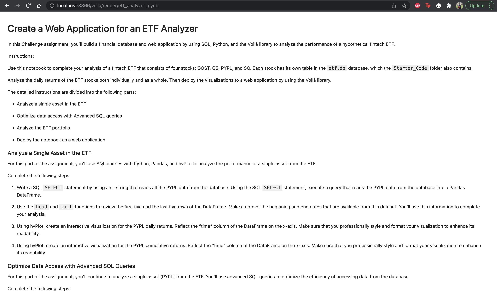

# ETF Analyzer

This analyzer looks into passive investing in the form of exchange-traded funds (ETFs) in order to provide more diversification within a basket of assets. This hypothetical fintech ETF looks into building a financial database and web application with the use of SQL, Python, and the Voila library.

---

## Required Modules/Libraries

SQLAlchemy -- Python SQL toolkit that allows us to run SQL code within our application

Voila Library -- turns Jupyter notebooks into standalone web applications with interactive widgets

---

## Datasets

etf.db -- database with four stocks: GOST, GS, PYPL, and SQ and their respective tables with open prices, close prices, daily returns

---

## Screenshots of Voila

---